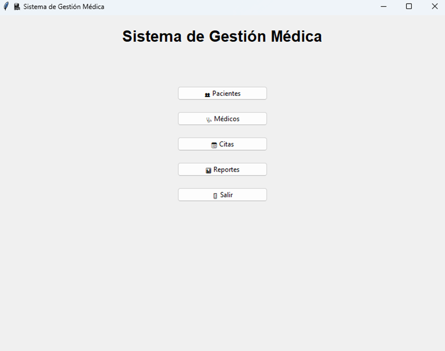
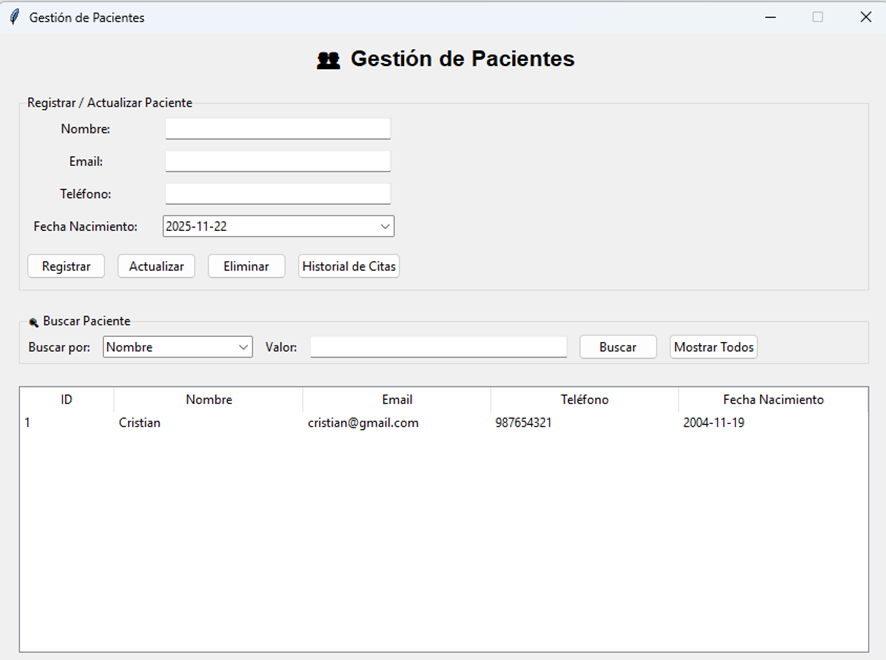
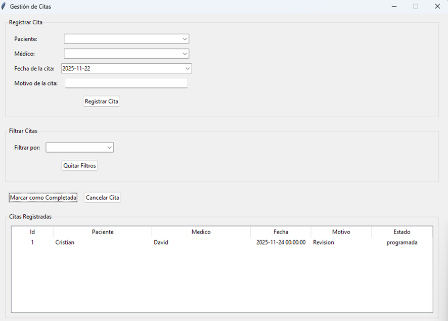
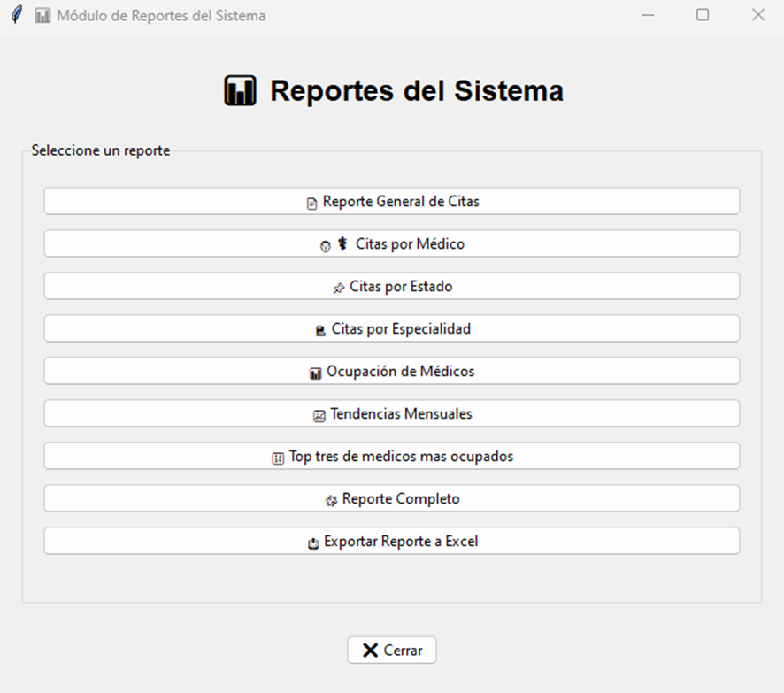
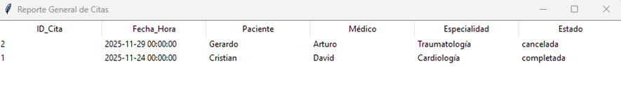
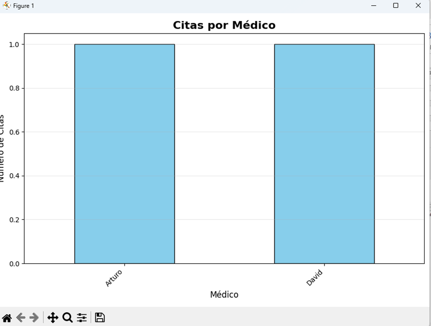
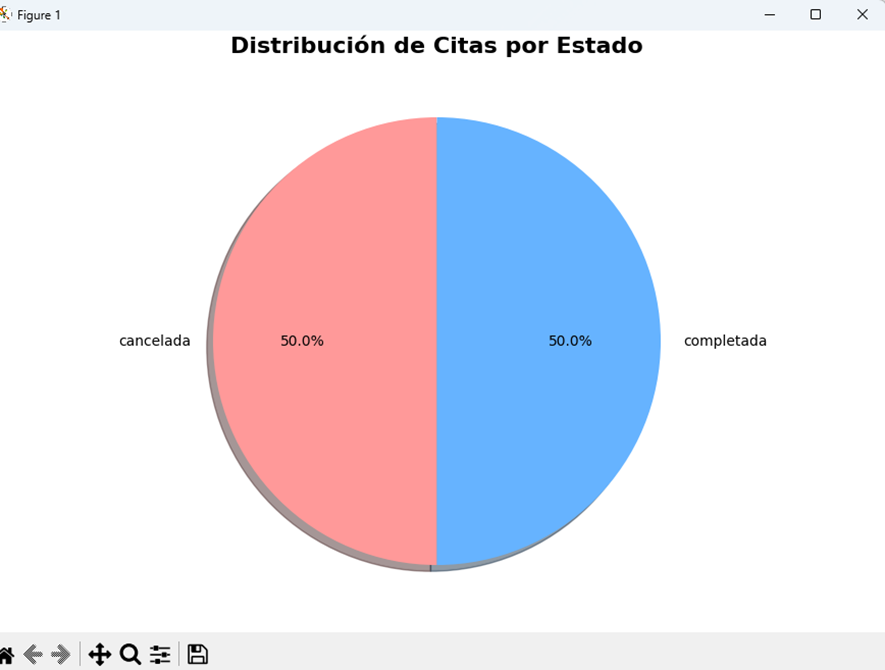
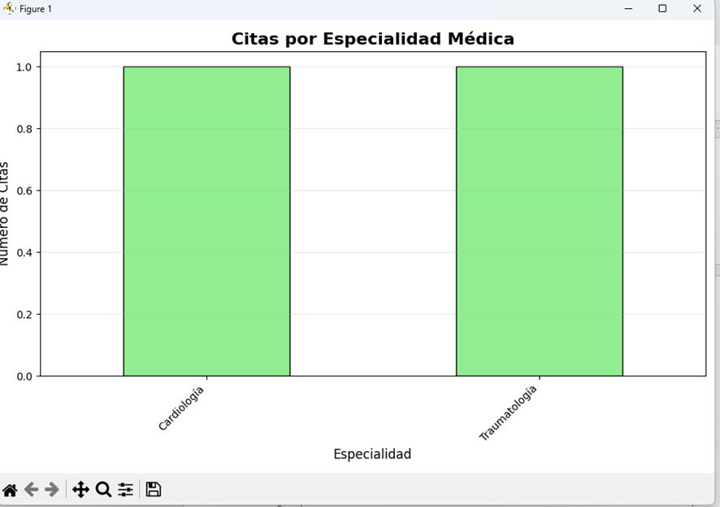
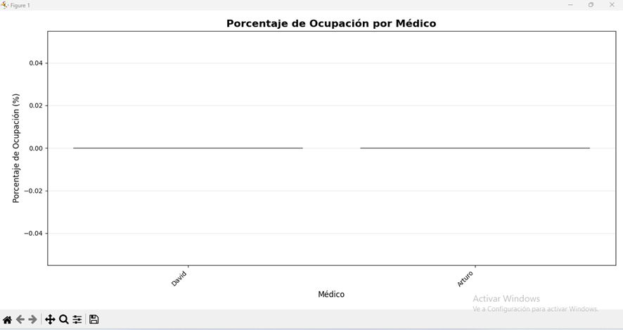
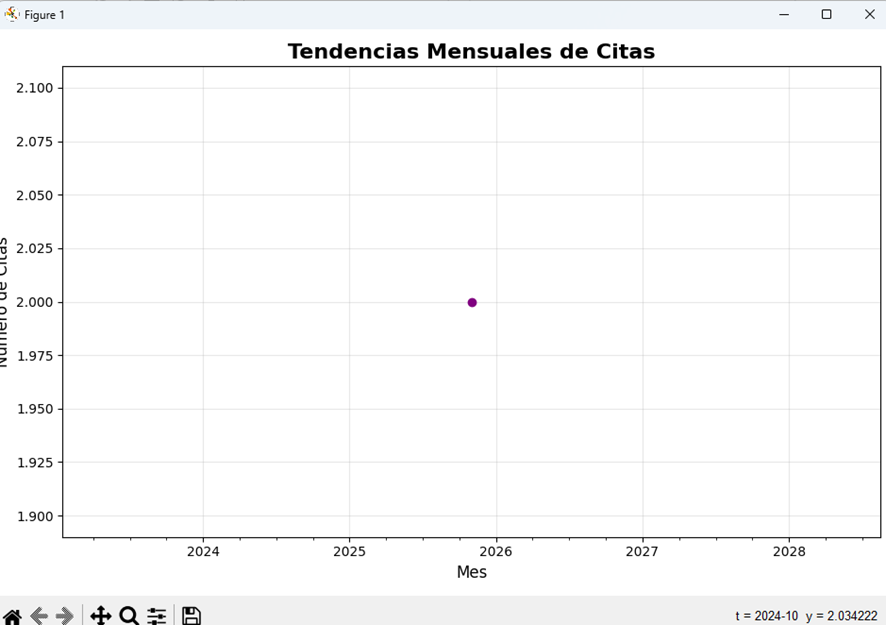

# 📌 Sistema de Gestión Médica Integral

Proyecto grupal desarrollado para el curso **Lenguajes de Programación**.  
El objetivo es implementar un sistema de software en Python aplicando **programación multiparadigma** (estructurada, orientada a objetos y funcional) para gestionar información médica de manera integral.

### Integrantes del equipo

- _[Benites Ostos, Anthony Yonayquer]_
- _[Bravo Borjas, Sandro César]_
- _[Adriano Condor, Cristian Anderzon]_
- _[Munives Santamaría, Fabricio Manuel]_

---

## 🎯 Objetivo del Proyecto

Desarrollar un software que permita gestionar pacientes, médicos y citas médicas, y generar reportes estadísticos, aplicando los 3 paradigmas de programación en Python:

| Paradigma               | Aplicación en el proyecto                              |
| ----------------------- | ------------------------------------------------------ |
| **Estructurado**        | Flujos secuenciales del menú principal y submenús.     |
| **Orientado a Objetos** | Modelado de entidades: Paciente, Médico, Cita.         |
| **Funcional**           | Funciones puras para cálculos, filtros y estadísticas. |

---

## 🧪 Requisitos funcionales

| Código | Requisito                                               |
| ------ | ------------------------------------------------------- |
| RF-01  | Registrar pacientes                                     |
| RF-02  | Registrar médicos                                       |
| RF-03  | Registrar citas médicas                                 |
| RF-04  | Listar entidades en tabla por consola                   |
| RF-05  | Editar / eliminar registros                             |
| RF-06  | Conectar a MySQL para almacenamiento persistente        |
| RF-07  | Generar reportes con visualización gráfica (matplotlib) |

---

## 📂 Arquitectura del Proyecto

```bash
/Proyecto_Gestion_Medica
│
├─ main.py # Punto de entrada del sistema
│
├─ config/
│ └─ database_config.py # Conexión MySQL
│
├─ models/
│ ├─ cita.py # Clase Cita (POO)
│ ├─ database.py # Clase Database (POO)
│ ├─ gestor_citas.py # Clase GestorCitas (POO)
│ ├─ medico.py # Clase Medico (POO)
│ └─ paciente.py # Clase Paciente (POO)
│
├─ services/
│ ├─ cita_service.py # CRUD + lógica
│ ├─ medico_service.py # CRUD + lógica
│ ├─ paciente_service.py # CRUD + lógica
│ └─ reportes_service.py # pandas + matplotlib
│
├─ ui/
│ ├─ cita_ui.py # UI
│ ├─ medico_ui.py # UI
│ ├─ menus.py # UI
│ ├─ paciente_ui.py # UI
│ └─ reportes.ui.py # UI
```

---

       ┌────────────────────────┐
       │           UI           │
       │   Menús / interacción  │
       └───────────▲────────────┘
                   │
       ┌───────────┴────────────┐
       │        SERVICES        │
       │ Validaciones / lógica  │
       └───────────▲────────────┘
                   │
       ┌───────────┴────────────┐
       │         MODELS         │
       │ Clases Paciente, etc.  │
       └───────────▲────────────┘
                   │
       ┌───────────┴────────────┐
       │      BASE DE DATOS     │
       │         MySQL          │
       └────────────────────────┘

---

## 🛠 Tecnologías Utilizadas

| Tecnología / Librería | Uso principal                                 |
| ---------------------- | --------------------------------------------- |
| **Python 3.12+**       | Lenguaje de programación principal.           |
| **MySQL**              | Base de datos relacional para almacenamiento. |
| **mysql.connector**    | Conexión entre Python y MySQL.                |
| **pandas**             | Análisis y manipulación de datos.             |
| **matplotlib**         | Visualización gráfica de reportes.            |
| **datetime**           | Manejo de fechas y horas de las citas.        |
| **tabulate**           | Mostrar datos en formato tabular en consola.  |
| **openpyxl**           | Permite crear/leer archivos Excel.            |

---

## 🧩 Justificación académica

Este proyecto aplica los 3 paradigmas del curso:

- **POO** para modelar entidades del dominio médico
- **Estructurada** para menús y flujo de interacción
- **Funcional** para filtros, estadísticas y cálculos puros

Además integra una base de datos real (MySQL) que añade persistencia, consultas y eficiencia de acceso, alineándose con el criterio de modelado completo del problema.

---

## Descripcion

El Sistema de Gestión Médica es una aplicación completa desarrollada en Python que permite administrar pacientes, médicos y citas médicas de manera eficiente. Está diseñado para clínicas, consultorios y centros médicos pequeños o medianos.

### Características Principales

- Gestión completa de pacientes y médicos
- Programación, cancelación y seguimiento de citas
- Reportes gráficos y estadísticas
- Interfaz intuitiva basada en menús
- Base de datos MySQL para persistencia de datos
- Múltiples paradigmas de programación (POO, Funcional, Estructurado)

## Requisitos del Sistema

### Requisitos Mínimos

- Sistema Operativo: Windows 10/11, macOS 10.14+, Ubuntu 18.04+
- Python: Versión 3.8 o superior
- MySQL: Versión 5.7 o superior
- Memoria RAM: 4 GB mínimo
- Espacio en disco: 500 MB libres

### Software Requerido

1. Python 3.8+ - [Descargar aquí](https://www.python.org/downloads/)
2. MySQL Server - [Descargar aquí](https://dev.mysql.com/downloads/mysql/)
3. Git (opcional) - [Descargar aquí](https://git-scm.com/)

## Instalación

### Paso 1: Clonar o Descargar el Proyecto

**Opción A - Descargar ZIP:**

1. Descarga el archivo ZIP del proyecto
2. Descomprímelo en una carpeta de tu elección
3. Navega a la carpeta descomprimida
   Opción B - Clonar con Git:

```bash
git clone https://github.com/FabricioUTP/Proyecto-Final-de-Lenguajes-de-Programaci-n.git
```

```bash
cd Proyecto-Final-de-Lenguajes-de-Programaci-n
```

### Paso 2: Crear Entorno Virtual (Recomendado)

Windows:

```bash
python -m venv venv

venv\Scripts\activate
```

macOS/Linux:

```bash
python3 -m venv venv

source venv/bin/activate
```

### Paso 3: Instalar Dependencias

```bash
pip install mysql-connector-python
```
```bash
pip install matplotlib
```
```bash
pip install pandas
```
```bash
pip install tkcalendar
```
```bash
pip install openpyxl
```

### Paso 4: Configurar Base de Datos MySQL

#### 1. Iniciar MySQL:

```bash
mysql -u root -p
```

#### 2. Crear Base de Datos:

```bash
CREATE DATABASE gestion_medica;

USE gestion_medica;
```

#### 3. Crear Tablas:

```bash
   CREATE TABLE pacientes (
   id INT AUTO_INCREMENT PRIMARY KEY,
   nombre VARCHAR(100) NOT NULL,
   email VARCHAR(100) UNIQUE,
   telefono VARCHAR(15) UNIQUE,
   fecha_nacimiento DATE
   );

   CREATE TABLE medicos (
   id INT AUTO_INCREMENT PRIMARY KEY,
   nombre VARCHAR(100) NOT NULL,
   especialidad VARCHAR(100),
   telefono VARCHAR(15) UNIQUE,
   email VARCHAR(100) UNIQUE
   );

   CREATE TABLE citas (
   id INT AUTO_INCREMENT PRIMARY KEY,
   paciente_id INT,
   medico_id INT,
   fecha_hora DATETIME,
   estado ENUM('programada', 'completada', 'cancelada') DEFAULT 'programada',
   motivo TEXT,
   FOREIGN KEY (paciente_id) REFERENCES pacientes(id) ON DELETE CASCADE,
   FOREIGN KEY (medico_id) REFERENCES medicos(id) ON DELETE CASCADE
   );
```

## Configuración Inicial

### Configurar Conexión a Base de Datos

#### Edita el archivo config/database_config.py:

```bash
DB_CONFIG = {
    'host': 'localhost',          # Dirección del servidor MySQL
    'user': 'tu_usuario',         # Tu usuario de MySQL
    'password': 'tu_contraseña',  # Tu contraseña de MySQL
    'database': 'gestion_medica', # Nombre de la base de datos
    'port': 3306                  # Puerto de MySQL (por defecto 3306)
}
```

#### Notas de Seguridad

- **NUNCA** compartas tus credenciales de base de datos
- Usa contraseñas seguras en producción
- Considera usar variables de entorno para datos sensibles

## Guía de Uso

Iniciar la Aplicación

```bash
cd Proyecto-Final-de-Lenguajes-de-Programaci-n
```

```bash
python main.py
```

Varás el menu principal



## Gestión de Pacientes

**Acceder al Módulo de Pacientes**



## Gestión de Médicos

**Acceder al Módulo de Médicos**


## Gestión de Citas

**Acceder al Módulo de Citas**



## Reportes y Estadísticas

**Acceder al Módulo de Reportes**



#### 4.1 Reporte General de Citas



#### 4.2 Citas por médicos



#### 4.3 Citas por estado



#### 4.4 Citas por especialidad



#### 4.5 Calcular Porcentaje de Ocupación



#### 4.6 Tendencias mensuales de cistas



## Solución de Problemas

Error: "No se pudo conectar a la base de datos"

Causas posibles:

1. MySQL no está ejecutándose
2. Credenciales incorrectas en database_config.py
3. Base de datos no existe

Soluciones:

1. Verificar que MySQL esté en ejecución
2. Revisar usuario y contraseña en la configuración
3. Crear la base de datos con el script SQL proporcionado

Error: "Módulo no encontrado"

Causas posibles:

1. Dependencias no instaladas
2. Entorno virtual no activado

Soluciones:

1. Activar entorno virtual
   • Linux/macOS
   source venv/bin/activate  
   • Windows
   venv\Scripts\activate

2. Instalar dependencias
   pip install -r requirements.txt
   Error: "Tabla no existe"
   Solución:
   Ejecutar el script SQL de creación de tablas nuevamente.
   Los gráficos no se muestran
   Causas posibles:
3. Matplotlib no compatible con el entorno
4. Sistema operativo sin soporte gráfico
   Solución alternativa:
   Usar la aplicación en un entorno con interfaz gráfica habilitada

## Consejos y Mejores Prácticas

### Para Citas

- Programa citas con al menos 30 minutos de diferencia
- Verifica la disponibilidad del médico antes de programar
- Cancela citas con al menos 24 horas de anticipación

### Para Datos

- Realiza backups regulares de la base de datos
- Mantén la información de contacto actualizada
- Usa emails válidos para notificaciones futuras

### Para Mantenimiento

- Actualiza las dependencias periódicamente
- Monitorea el espacio en disco de la base de datos
- Revisa los logs de errores regularmente

### Soporte

Si encuentras problemas o tienes preguntas:

1. Revisa este manual primero
2. Verifica la configuración de la base de datos
3. Consulta los mensajes de error proporcionados por el sistema
4. Contacta al administrador del sistema

---

**¡Listo para Usar!**

Ahora tienes todo lo necesario para operar el Sistema de Gestión Médica. El sistema está diseñado para ser intuitivo y eficiente, facilitando la administración de tu consultorio o clínica.
